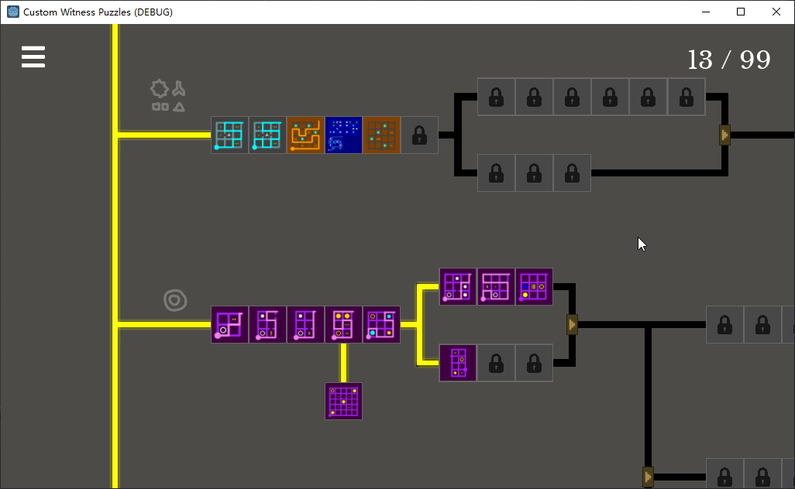
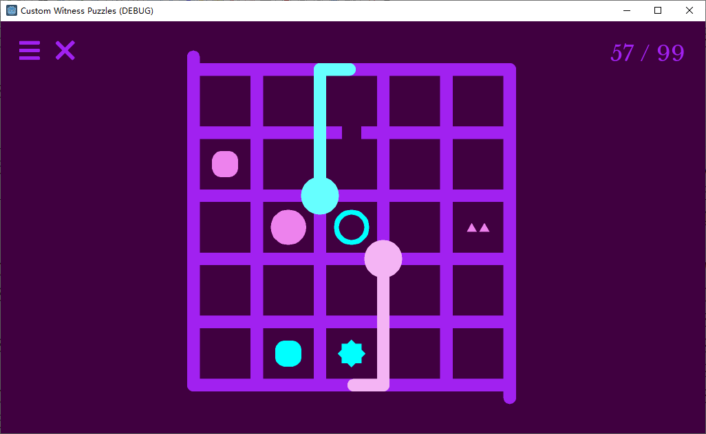
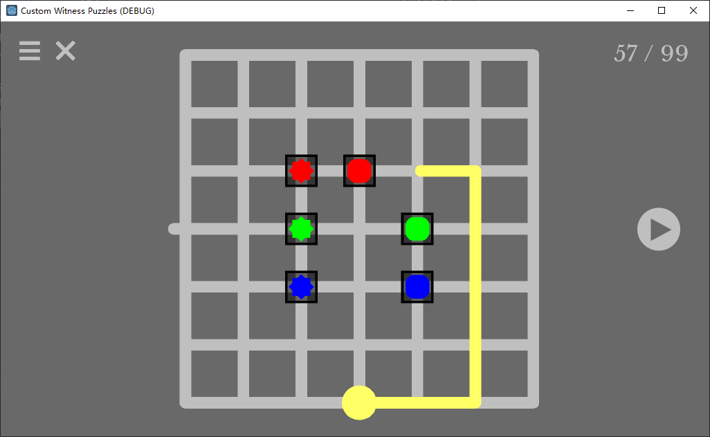
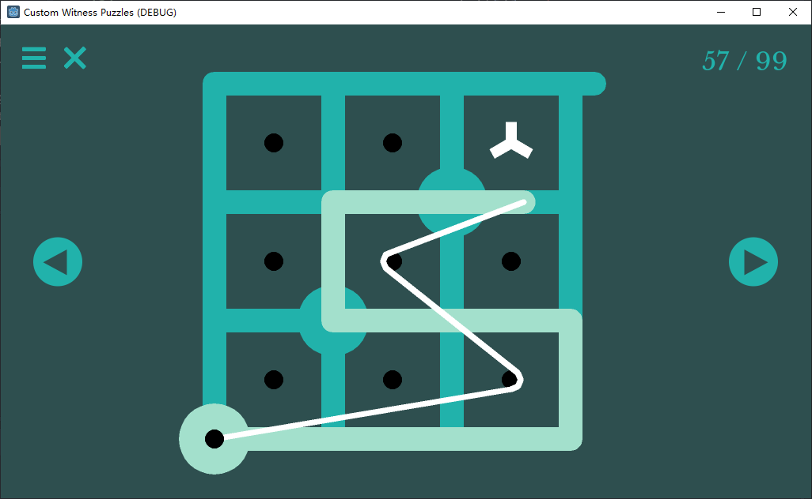
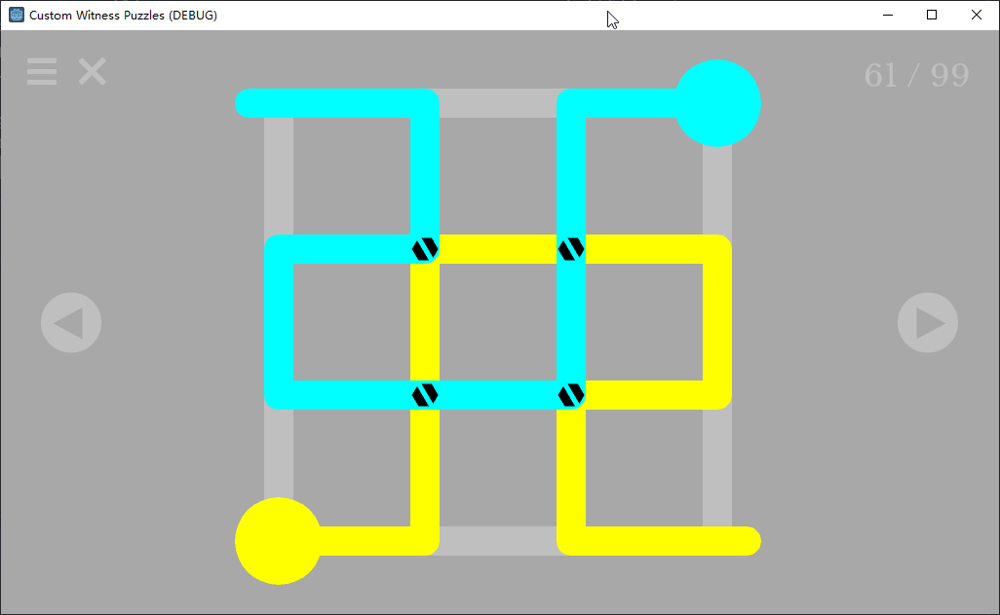
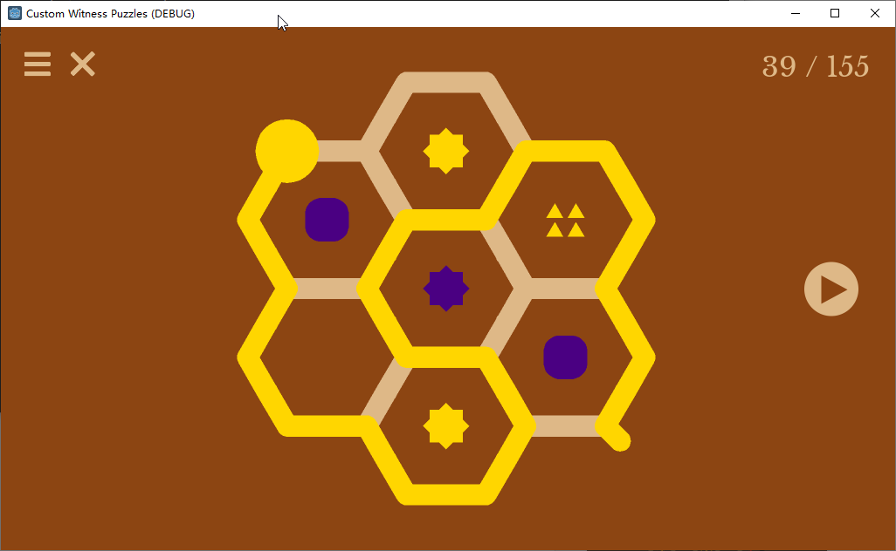

# What The Witness?

<em>What The Witness?</em> is a fan game of <em>The Witness</em> (2016) that features custom puzzle mechanics. Most mechanics/puzzle sets are created and shared by game fans, and we collected them in this game. 

<em>The Witness</em> (2016) is a logic puzzle game by Jonathan Blow et al. from Thekla, Inc. featuring line drawing puzzles on grids with various rules. 

In this collection, many fan puzzles were designed and created by various fans during the WitCup contest, a fan-organized competition on solving new The Witness puzzles under limited time. While the 4th and 5th WitCups are already programmed by Artless, other WitCup puzzles were only archived by images and we thought it would be good if we can revive them using a game engine. This is a major reason to start the project.

# Download & Credits

https://alith.itch.io/what-the-witness

# Screenshots

# Build Environment

Godot 3.3.2 (https://godotengine.org/)

See in-game credits for details.